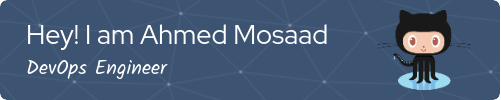

  

###
<h1 align="center">Hi 👋, I'm Ahmed Mohamed Mosaad</h1>
<h3 align="center">DevOps / Cloud / SysAdmin Engineer</h3>

- 🌱 I’m currently learning :  DevOps
- 📫 How to reach me :  Ahmedmosaad112@std.mans.edu.eg
- 📄 Know about my experiences :  https://www.linkedin.com/in/ahmed-mosaad-91239518a/

 

  

<h3 align="left">Connect with me:</h3>

<h3 align="left">Languages and Tools:</h3>

<h3 align="left">Stars</h3>

